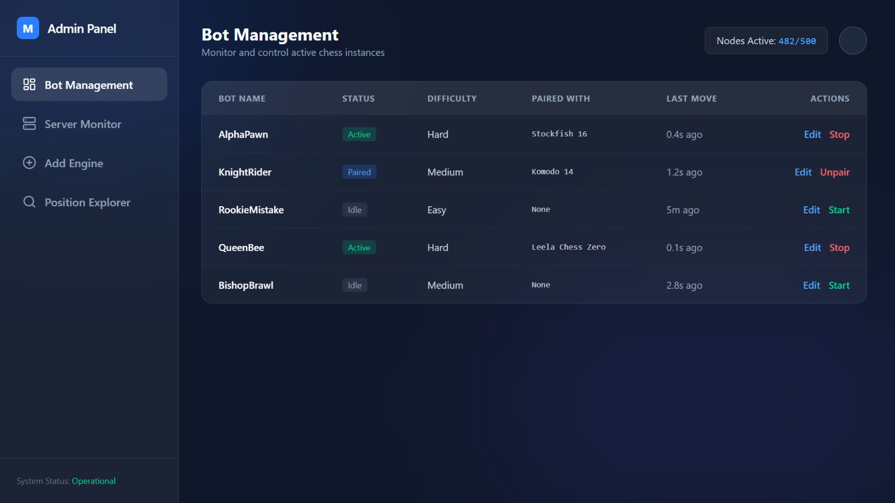
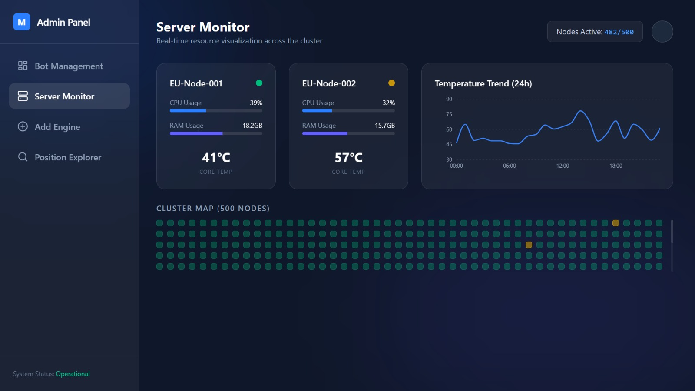
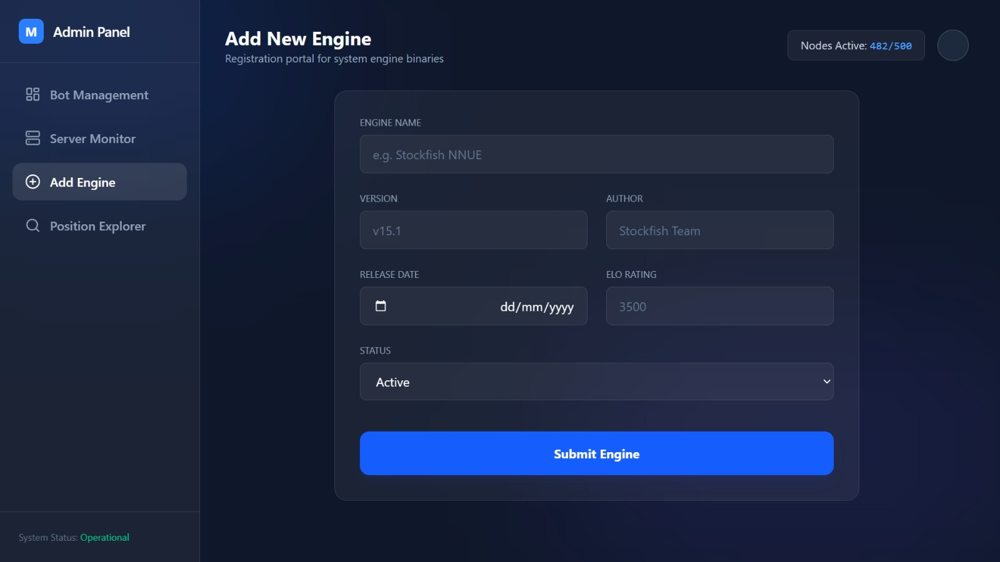
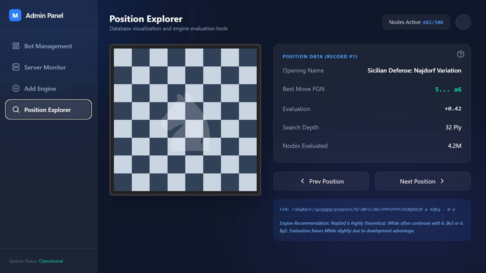
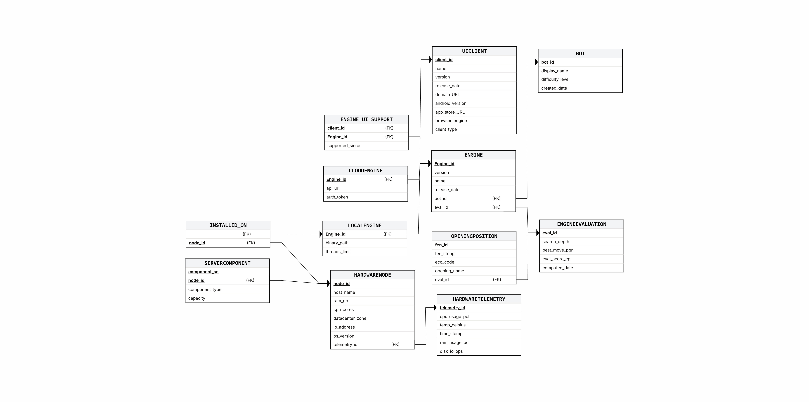
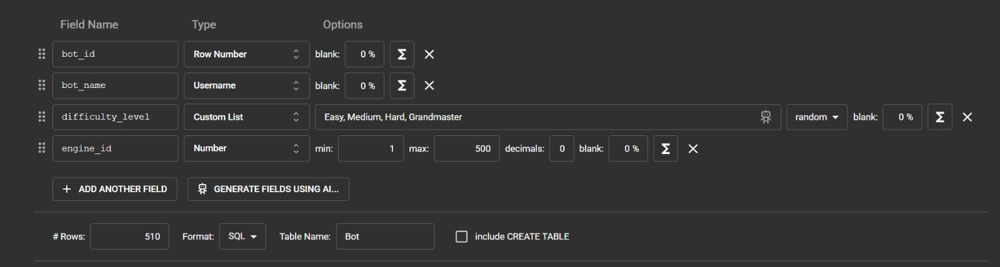
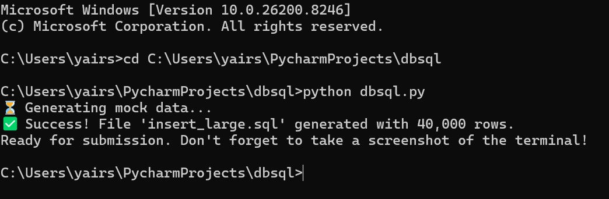
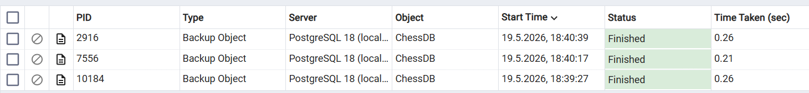

# Database Project - Phase A ♟️
**Chess Tournament Management System - Engines, Bots, and UIs (Department 4)**

**Submitted by:**
* Yair Sapanov (ID: 216737783)
* Daniel Sasson (ID: 217464478)
* Academic Institution: Jerusalem College of Technology (Machon Lev)

---

## Table of Contents
1. [Introduction & System Architecture](#introduction--system-architecture)
2. [User Interface (UI) Mockups](#user-interface-ui-mockups)
3. [Diagrams & Design Decisions](#diagrams--design-decisions)
4. [Data Population](#data-population)
5. [Database Backup](#database-backup)

---

## Introduction & System Architecture
Our project focuses on the technological infrastructure behind a chess tournament management system. Our department (Department 4) is responsible for managing the heavy computational servers (HardwareNodes), the chess engines running on them (such as Stockfish and Komodo), and the automated bots utilizing these engines at various difficulty levels.

Additionally, the system manages access to different user interfaces (UIClient - Mobile & Web) and maintains a massive database of opening positions (OpeningPosition) alongside the engines' evaluations for these positions (EngineEvaluation).

[**Click here to view the full Data Dictionary and Specification Document (PDF)**](./Stage_1/Data_Dictionary.pdf)

---

## User Interface (UI) Mockups
*The initial HTML/CSS prototype for these screens was designed and generated using Google AI Studio, following a Top-Down design approach.*
👉 **[Click here to view the Google AI Studio Prompt & Generation](https://ai.studio/apps/a5e57c20-f100-45bc-9296-17f3dcfbc5b2)**

We built an HTML/CSS Dashboard mockup displaying the core entities of our project:

1. **Bot Management (Bots):** A list of active bots, their linked engines, and difficulty levels.
   

2. **Server Monitor (Telemetry):** Real-time tracking of temperature and CPU usage for our computational servers.
   

3. **Engine Evaluations Explorer:** An interface featuring a graphical chessboard that allows searching for a FEN string of an opening position to get the best move evaluated by the engines.
   

4. **Add Engine:** A form for inserting a new engine into the database and linking it to supported interfaces.
   

---

## Diagrams & Design Decisions

### Entity-Relationship Diagram (ERD)
In this project, we incorporated a **Weak Entity** (HardwareTelemetry, which relies on HardwareNode), an **Inheritance** hierarchy (UIClient as the supertype, MobileClient and WebClient as subtypes), and a **Many-to-Many (M:N) relationship** between Engine and UIClient, represented by the `Engine_UI_Support` junction table.

### Relational Schema (DSD)
Mapping of the database tables and foreign keys.

---

## Data Population
As required, we populated the database using 3 different methods:

1. **Manual Insertion (SQL Script):** Writing manual `INSERT` queries for the base tables and relationship tables (found in `insertTables.sql`).
2. **Using Mockaroo:** Generating approximately 500 automated rows for the Bot table.
   
3. **Big Data Insertion via Python:**
   We wrote a Python script that generates 40,000 rows for the `OpeningPosition` and `HardwareTelemetry` tables to test load capacity.
   

---

## Database Backup
The code was successfully executed on a PostgreSQL server (version 16+) via the pgAdmin interface. All tables were created, foreign key constraints were enforced, and data successfully populated the system. 
The full database backup file is included in the repository as `Backup.sql`.

