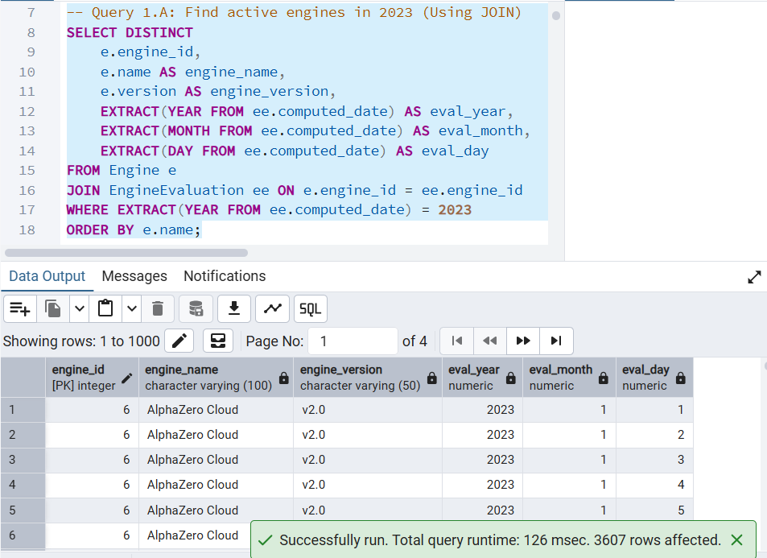
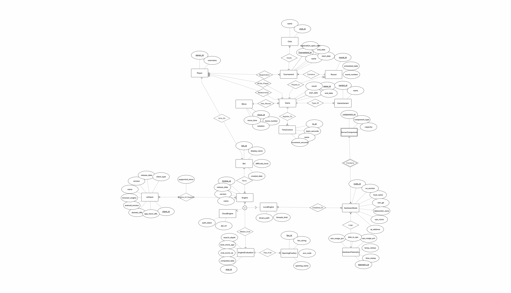
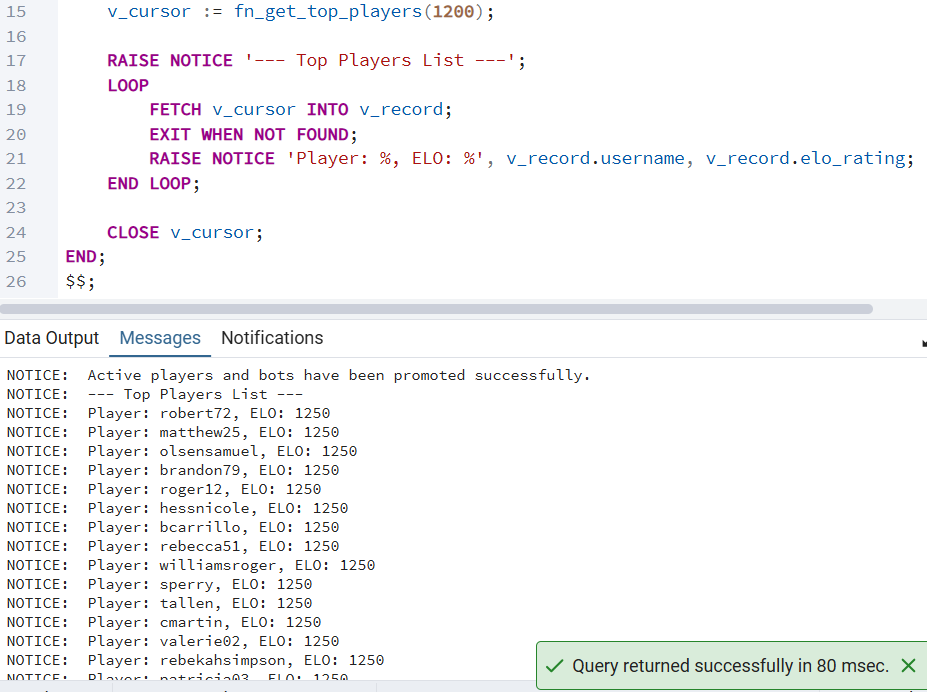

# Chess Engine & Bot Management Database System ♟️🖥️

A robust, relational database system built with **PostgreSQL** designed to manage, monitor, and optimize distributed chess engines, automated play bots, physical computing nodes, and live performance telemetry.

---

## Project Overview
This project models a scalable platform that tracks chess engine analysis (such as search depths and evaluation scores), orchestrates automated gaming bots with varying difficulty tiers, maps local engine software instances to specific bare-metal server infrastructure, and continuously logs granular hardware performance telemetry data.

---

## 🛠️ Phase A: Schema Design & Data Ingestion
The objective of the first phase was establishing a solid relational foundation and stress-testing the architecture with a large dataset.

### Key Deliverables:
* **Relational Schema:** Designed and implemented 12 interconnected tables using optimal data types, explicit Primary Keys, and strictly enforced Referential Integrity (Foreign Keys with cascading behaviors).
* **Big Data Ingestion:** Developed targeted scripting pipelines to populate the system with mock telemetry and log records.
* **Volume Benchmarks:** * Maintained a strict baseline of at least **500 records** per standard configuration table.
  * Generated high-volume telemetry datasets exceeding **20,000 records** in heavy transaction tables (`HardwareTelemetry` and `EngineEvaluation`) to evaluate production-level load behavior.

---

## 🚀 Phase B: Advanced Queries, DML & Performance Optimization
The second phase introduced data analytical filtering, strict validation business rules, and indexing mechanisms to minimize latency under high record volumes.

### Key Deliverables:
* **Analytical Queries:** Penned 8 advanced `SELECT` operations leveraging conditional groupings (`GROUP BY`, `HAVING`), multi-key ordering, and atomic date-part Extractions (`EXTRACT`).
* **Efficiency Analysis:** Evaluated query execution strategies by implementing specific queries in dual formats (comparing `JOIN` vs. `IN` and `DISTINCT` vs. `EXISTS`) to understand execution path optimizations.
* **Data Control Operations:** Implemented 3 structural `UPDATE` algorithms and 3 cascading `DELETE` routines to handle data maintenance.
* **Integrity Enforcement:** Created 3 operational database constraints using custom `CHECK` constraints (date validations, minimal hardware memory bounds) and multi-column `UNIQUE` constraints.
* **Performance Indexing:** Added 3 physical database indexes (`B-Tree`) on high-traffic timestamp, search criteria, and foreign key boundaries, measuring real-world millisecond performance gains via `EXPLAIN ANALYZE`.
* **Transaction Control:** Demonstrated transaction isolation properties using atomic `BEGIN`, `COMMIT`, and `ROLLBACK` states to safe-guard memory alterations.

---

## 🤝 Phase C: System Integration & Reverse Engineering
The third phase focused on integrating an external database system (managing Chess Players, Clubs, Tournaments, and Games) into our existing architecture, without destroying or dropping any existing tables. 

### Key Deliverables:
* **Reverse Engineering:** Analyzed external physical DDL files to reconstruct conceptual Entity-Relationship Diagrams (ERD) and logical Data Structure Diagrams (DSD).
* **Non-Destructive Integration:** Executed strategic `ALTER TABLE` commands to forge a conceptual 1:1 linkage between external human `Player` entities and internal automated `Bot` entities, allowing AI to officially register in human tournaments.
* **Cross-System Views:** Engineered complex, multi-table logical views combining structural, configuration, and chronological parameters from both sub-systems to serve distinct administrative perspectives.

---

## ⚙️ Phase D: PL/pgSQL Programming
The fourth phase elevated the database from a static storage system to an active backend by implementing server-side business logic using PL/pgSQL.

### Key Deliverables:
* **Custom Functions:** Developed parameterized functions utilizing explicit cursors and `refcursor` to dynamically calculate tournament scores and fetch top-tier players/bots.
* **Automated Procedures:** Created batch-processing procedures with complex conditional branching (`IF/ELSE`) and loops to execute multi-table DML updates (e.g., closing tournaments and granting ELO/difficulty promotions).
* **Active Triggers:** Designed robust `BEFORE INSERT` and `BEFORE UPDATE` triggers to automatically enforce critical business rules, such as preventing negative ELO ratings and blocking registrations to closed events.
* **Exception Handling:** Integrated comprehensive `RAISE EXCEPTION` blocks across all modules to ensure transactional safety, data validation, and logical integrity.

---

## 📁 Repository Structure
Each stage's source files, backup utilities, and runtime validation screenshots are neatly isolated within their respective directories:
* `/Stage_1` - Initial relational schema scripts, historical dataset mockups, and base diagrams.
* `/Stage_2` - Optimization routines, transaction scripts, advanced queries, and analytics documentation.
* `/Stage_3` - Reverse engineering algorithms, integrated schemas, view definitions, and Phase 3 backups.
* `/Stage_4` - PL/pgSQL modules (Functions, Procedures, Triggers), main execution scripts, and Phase 4 backups.