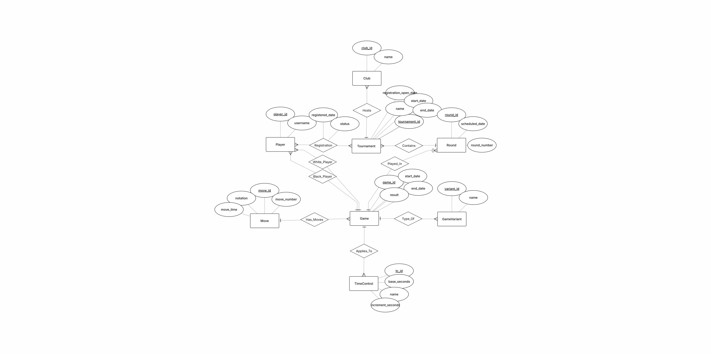
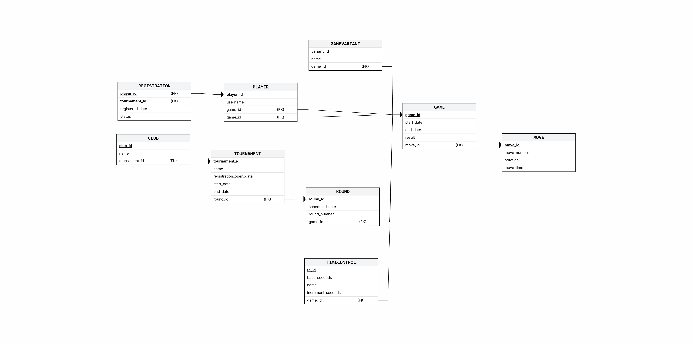
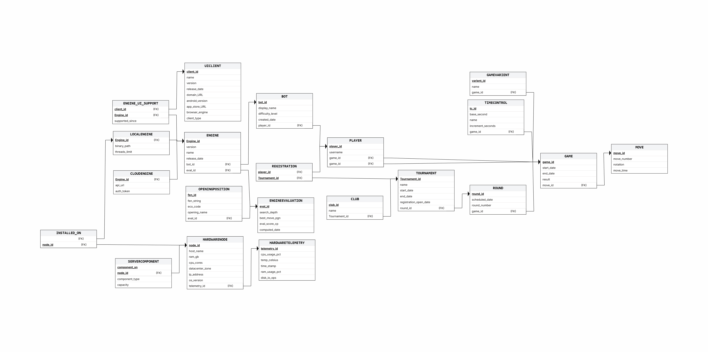
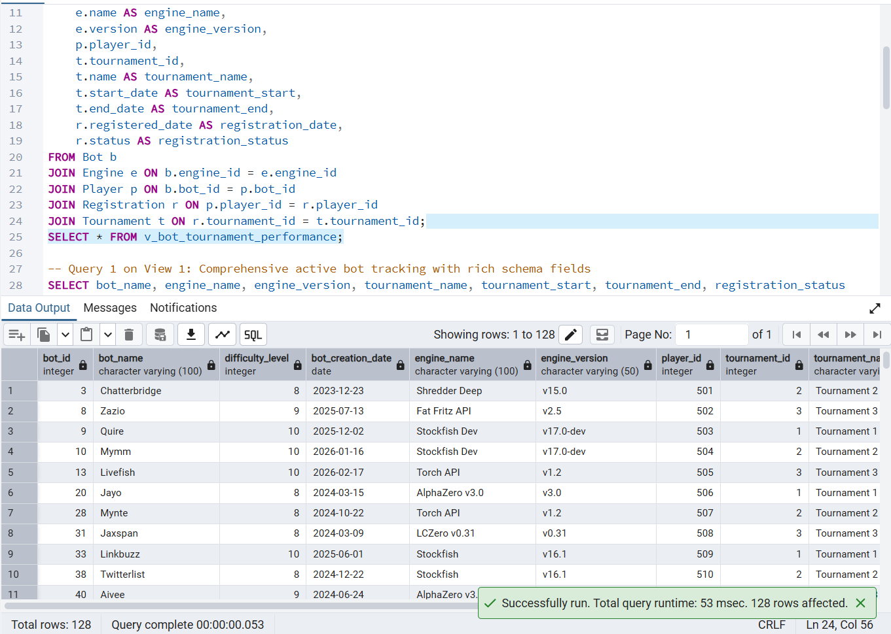
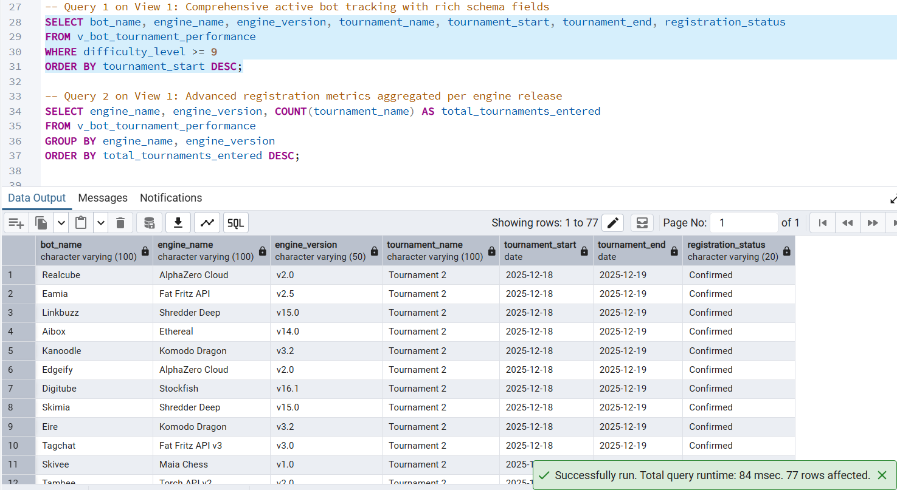
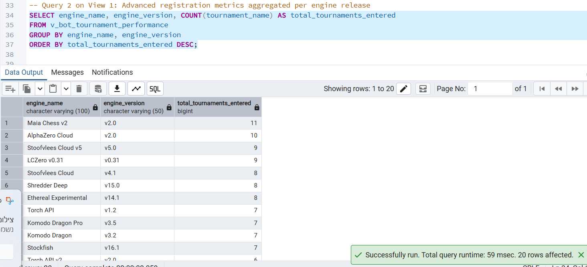
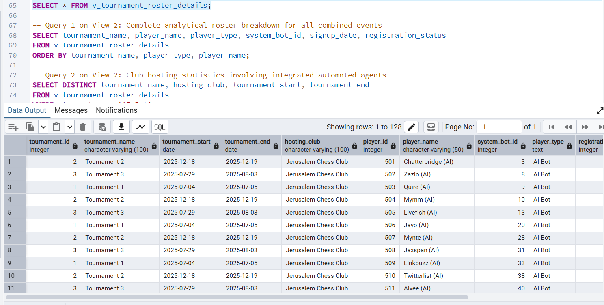
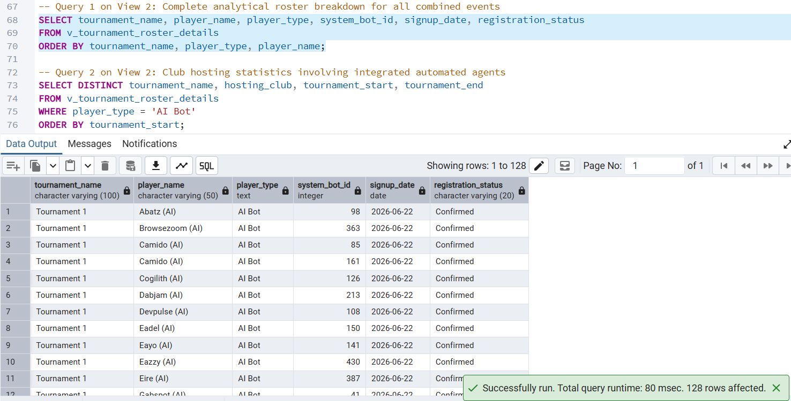
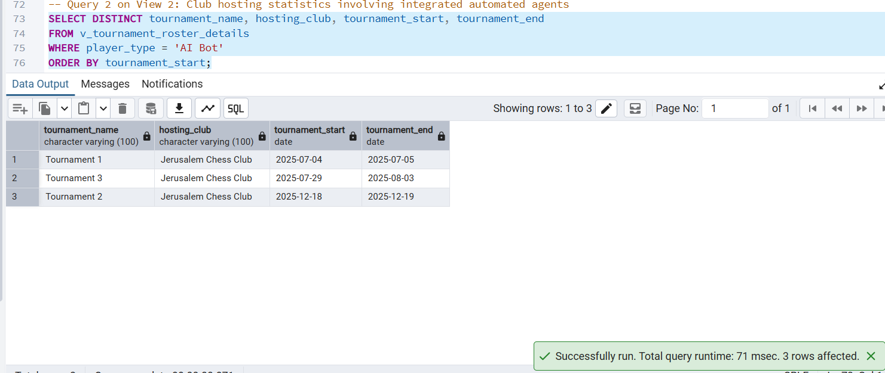

# ♟️ Phase C: System Integration & Reverse Engineering 🤝

In this final phase, we successfully integrated an external database system (managing Chess Players, Clubs, Tournaments, and Games) into our existing architecture (managing Chess Engines, Bots, and Hardware). The integration was performed seamlessly without dropping any existing structures, strictly utilizing `ALTER TABLE` commands to merge the conceptual worlds.

---

## 🛠️ 1. Reverse Engineering Algorithm (הינדוס לאחור)

To construct the Entity-Relationship Diagram (ERD) of the external system from their raw physical backup (`createTables.sql`), we applied the following reverse-engineering algorithm:

1. **Entity Identification:** Every `CREATE TABLE` statement that did not function strictly as a bridging table was mapped to an independent conceptual Entity (e.g., `Player`, `Club`, `Tournament`, `Game`, `TimeControl`, `Round`).
2. **Attribute & Primary Key Mapping:** Columns within the tables were translated into Attributes. Columns designated with the `PRIMARY KEY` constraint were marked as the identifying key attributes for their respective entities.
3. **Relationship & Cardinality Extraction:**
   * **1:N (One-to-Many):** We identified `FOREIGN KEY` constraints. The table holding the foreign key represents the "Many" (N) side, while the referenced table represents the "One" (1) side. For example, `club_id` in the `Tournament` table indicates a 1:N relationship between Club and Tournament.
   * **M:N (Many-to-Many):** Tables containing multiple foreign keys serving as composite links (e.g., the `Registration` table linking `Tournament` and `Player`) were identified as associative entities / bridge tables representing M:N relationships.
   * **Multiple Relationships:** When a table held multiple foreign keys referencing the same target (e.g., `white_player_id` and `black_player_id` in the `Game` table referencing `Player`), we mapped them as two distinct relationships between the Game and Player entities.
4. **Business Rule Restoration:** Constraints such as `CHECK (end_date >= start_date)` were extracted and documented as logical business rules in the Data Structure Diagram (DSD).

---

## 🧠 2. Integration Strategy & Business Decisions (החלטות האינטגרציה)

**🎯 The Core Concept: "Bots as Competitive Players"**
The primary goal of the integration was to allow our automated Chess Bots (`Bot` table) to interact seamlessly with the external system's human ecosystem (`Player`, `Tournament`, `Game`). 

Instead of duplicating data or breaking the external system's logic, we made the following architectural decisions:

* **Decision 1: The Linkage Point**
  We decided that a `Bot` from our system can register and play exactly like a human `Player`. To achieve this without altering the core structure of the external system's games and tournaments, we modified the `Player` table to accommodate bots.
* **Decision 2: Structural Modification (`ALTER TABLE`)**
  We executed an `ALTER TABLE` on the external `Player` table, adding a nullable Foreign Key column named `bot_id` that references our `Bot` table (`UNIQUE` constraint applied to ensure a 1:1 relationship). 
  * If `bot_id` is `NULL`, the player is a standard human.
  * If `bot_id` contains a valid ID, the player is an automated engine bot from our database.
* **Decision 3: Data Integrity**
  By linking at the `Player` level, bots can now naturally participate in the `Registration` table for tournaments and be assigned as `white_player_id` or `black_player_id` in the `Game` table, inheriting all existing external relationships seamlessly.

---

## 📊 3. ERD & DSD Diagrams

Here are the visual representations of the external system and the final integrated architecture:

### The External System (New Wing)
**ERD (Conceptual):**

**DSD (Logical):**

### The Fully Integrated Architecture
**Combined ERD:**

**Combined DSD:**

---

## 🔍 4. Cross-System Views & Analysis (מבטים מורחבים)

To provide deep administrative insights and satisfy analytical data requirements, we built two highly enriched multi-table views combining structural, configuration, and chronological parameters from both sub-systems.

### 🤖 View 1: `v_bot_tournament_performance` (Our Perspective - Engine Admin)
**Description:** This view establishes a complete bridge tracking how our internal automated entities perform across external events. It pulls bot attributes, engine software build versions, tournament timelines, and formal registration records into a single dashboard view.

**View Output:**

* **Query 1:** Isolates elite grandmaster-tier bots, displaying their full engine version info alongside their multi-date tournament schedules.
  

* **Query 2:** Aggregates participation records across engine families and versions to monitor structural software performance metrics.
  

---

### 🏆 View 2: `v_tournament_roster_details` (External Perspective - Tournament Organizer)
**Description:** Designed for external tournament monitors, this view combines roster applications, hosting clubs, and structural user profiles. It evaluates the presence of `bot_id` values to dynamically tag entities as 'Human' or 'AI Bot' for fair-play enforcement.

**View Output:**

* **Query 1:** Extracts a full analytical roster across all ongoing tournaments, clearly mapping sign-up timelines and system reference IDs.
  

* **Query 2:** Audits physical hosting venues (Clubs) that accommodate computing agents, filtering structural dates to track technological adaptation.
  

---
*End of Phase C Documentation. Database ready for production.*