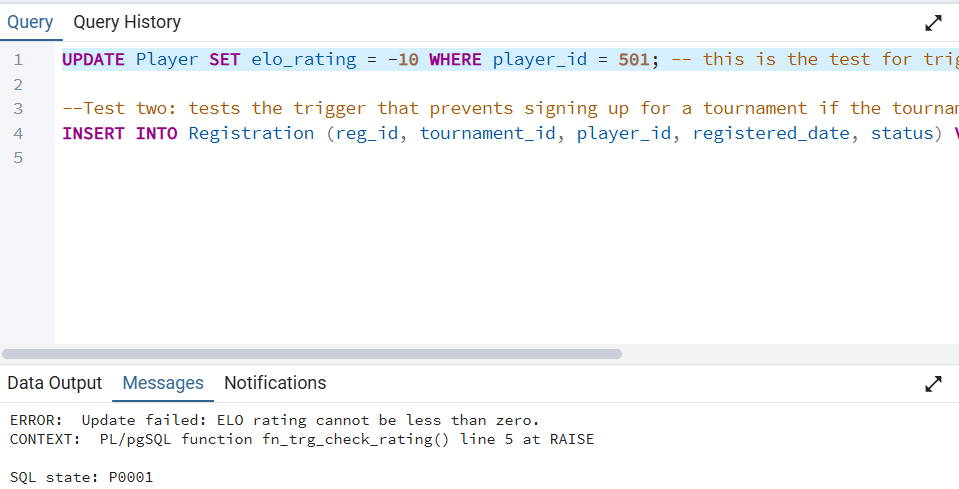
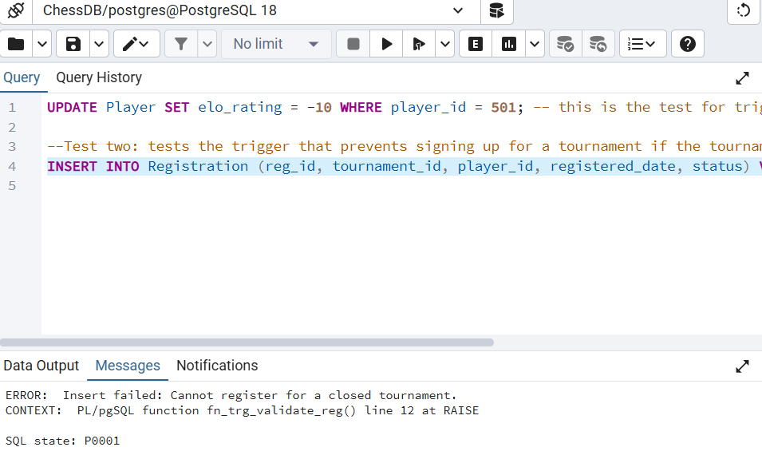
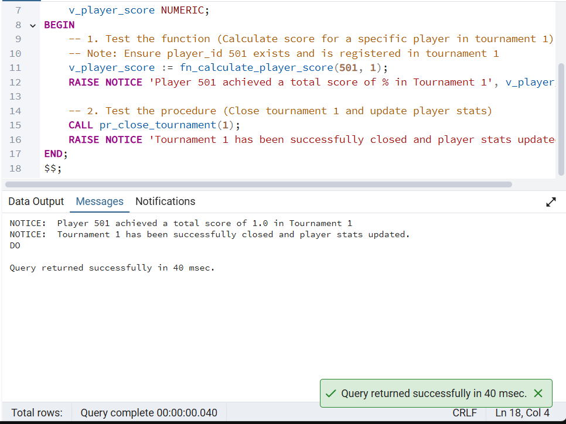
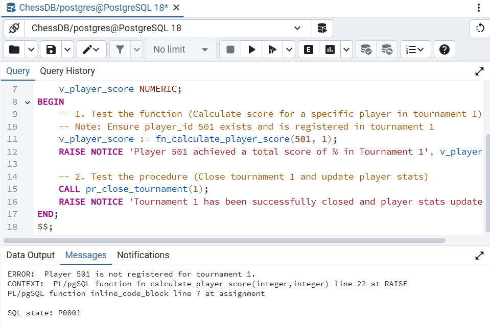

# Phase D: PL/pgSQL Programming ⚙️

In this phase, we implemented advanced server-side programming using PL/pgSQL. This includes custom functions, procedures, and triggers utilizing explicit and implicit cursors, `refcursor`, branching, loops, records, and comprehensive exception handling.

---

## 1. Schema Modifications (`AlterTable.sql`)
To support complex business logic, we enriched the schema by adding rating and statistics columns to the `Player` table, and a status tracker for the `Tournament` table.

```sql
ALTER TABLE Player ADD COLUMN elo_rating INT DEFAULT 1200;
ALTER TABLE Player ADD COLUMN total_games_played INT DEFAULT 0;
ALTER TABLE Tournament ADD COLUMN status VARCHAR(20) DEFAULT 'Open';
```

---

## 2. Functions

### Function 1: `fn_calculate_player_score`
* **Description:** Calculates a player's total score in a specific tournament (1 point for a win, 0.5 for a draw). Validates registration and throws a custom exception if the player is not registered. Uses an explicit cursor to iterate over game records.
* **Features Used:** Explicit Cursor, Exception, Loop, Branching (IF/ELSIF), Record.

```sql
CREATE OR REPLACE FUNCTION fn_calculate_player_score(p_player_id INT, p_tourney_id INT)
RETURNS NUMERIC AS $$
DECLARE
    v_game_rec RECORD;
    v_total_score NUMERIC := 0.0;
    v_is_registered BOOLEAN;
    
    -- Explicit Cursor with updated JOINs using RoundResult
    c_player_games CURSOR FOR
        SELECT g.white_player_id, g.black_player_id, g.result
        FROM Game g
        JOIN RoundResult rr ON g.game_id = rr.game_id
        JOIN Round r ON rr.round_id = r.round_id
        WHERE r.tournament_id = p_tourney_id 
          AND (g.white_player_id = p_player_id OR g.black_player_id = p_player_id);
BEGIN
    SELECT EXISTS(
        SELECT 1 FROM Registration 
        WHERE player_id = p_player_id AND tournament_id = p_tourney_id
    ) INTO v_is_registered;
    
    IF NOT v_is_registered THEN
        RAISE EXCEPTION 'Player % is not registered for tournament %.', p_player_id, p_tourney_id;
    END IF;

    OPEN c_player_games;
    LOOP
        FETCH c_player_games INTO v_game_rec;
        EXIT WHEN NOT FOUND;

        IF v_game_rec.result = '1/2-1/2' THEN
            v_total_score := v_total_score + 0.5;
        ELSIF v_game_rec.result = '1-0' AND v_game_rec.white_player_id = p_player_id THEN
            v_total_score := v_total_score + 1.0;
        ELSIF v_game_rec.result = '0-1' AND v_game_rec.black_player_id = p_player_id THEN
            v_total_score := v_total_score + 1.0;
        END IF;
    END LOOP;
    CLOSE c_player_games;

    RETURN v_total_score;
END;
$$ LANGUAGE plpgsql;
```
* **Proof of Execution:** *(See Main Program 1 below for success and exception outputs)*

### Function 2: `fn_get_top_players`
* **Description:** Returns a `refcursor` pointing to a result set of players (both human and AI bots) who possess an ELO rating greater than or equal to a provided threshold. Includes exception handling for invalid negative inputs.
* **Features Used:** Ref Cursor, Exception, Implicit Branching.

```sql
CREATE OR REPLACE FUNCTION fn_get_top_players(p_min_rating INT)
RETURNS refcursor AS $$
DECLARE
    rc_players refcursor;
BEGIN
    IF p_min_rating < 0 THEN
        RAISE EXCEPTION 'Invalid rating: Minimum rating cannot be negative.';
    END IF;

    OPEN rc_players FOR
        SELECT p.player_id, p.username, p.elo_rating, b.difficulty_level
        FROM Player p
        LEFT JOIN Bot b ON p.bot_id = b.bot_id
        WHERE p.elo_rating >= p_min_rating
        ORDER BY p.elo_rating DESC;

    RETURN rc_players;
END;
$$ LANGUAGE plpgsql;
```
* **Proof of Execution:** *(See Main Program 2 below for successful fetch loop execution)*

---

## 3. Procedures

### Procedure 1: `pr_close_tournament`
* **Description:** Officially closes an active tournament by updating its status to 'Completed'. Iterates through all unique participants using a cursor and updates their total games played counter via a DML operation.
* **Features Used:** DML (UPDATE), Exception, Explicit Cursor, Loop.

```sql
CREATE OR REPLACE PROCEDURE pr_close_tournament(p_tourney_id INT)
LANGUAGE plpgsql
AS $$
DECLARE
    v_status VARCHAR(20);
    v_player_rec RECORD;
    
    -- Cursor with updated JOINs using RoundResult
    c_players CURSOR FOR
        SELECT DISTINCT player_id 
        FROM (
            SELECT g.white_player_id AS player_id
            FROM Game g JOIN RoundResult rr ON g.game_id = rr.game_id JOIN Round r ON rr.round_id = r.round_id
            WHERE r.tournament_id = p_tourney_id
            UNION
            SELECT g.black_player_id AS player_id
            FROM Game g JOIN RoundResult rr ON g.game_id = rr.game_id JOIN Round r ON rr.round_id = r.round_id
            WHERE r.tournament_id = p_tourney_id
        ) AS participants;
BEGIN
    SELECT status INTO v_status FROM Tournament WHERE tournament_id = p_tourney_id;
    IF NOT FOUND THEN RAISE EXCEPTION 'Tournament ID % does not exist.', p_tourney_id; END IF;
    IF v_status = 'Completed' THEN RAISE EXCEPTION 'Tournament ID % is already closed.', p_tourney_id; END IF;

    UPDATE Tournament SET status = 'Completed' WHERE tournament_id = p_tourney_id;

    OPEN c_players;
    LOOP
        FETCH c_players INTO v_player_rec;
        EXIT WHEN NOT FOUND;
        UPDATE Player SET total_games_played = total_games_played + 1 WHERE player_id = v_player_rec.player_id;
    END LOOP;
    CLOSE c_players;
END;
$$;
```

### Procedure 2: `pr_promote_active_players`
* **Description:** Promotes active participants based on a game-count threshold. Uses conditional branching to determine entity type: Human players receive an ELO rating boost, while integrated Bots receive a difficulty level increase.
* **Features Used:** DML (UPDATE), Explicit Cursor, Loop, Branching (IF/ELSE).

```sql
CREATE OR REPLACE PROCEDURE pr_promote_active_players(p_min_games INT)
LANGUAGE plpgsql
AS $$
DECLARE
    v_player_rec RECORD;
    c_active_players CURSOR FOR SELECT player_id, elo_rating, bot_id FROM Player WHERE total_games_played >= p_min_games;
BEGIN
    OPEN c_active_players;
    LOOP
        FETCH c_active_players INTO v_player_rec;
        EXIT WHEN NOT FOUND;

        IF v_player_rec.bot_id IS NOT NULL THEN
            UPDATE Bot SET difficulty_level = LEAST(difficulty_level + 1, 10) WHERE bot_id = v_player_rec.bot_id;
        ELSE
            UPDATE Player SET elo_rating = elo_rating + 50 WHERE player_id = v_player_rec.player_id;
        END IF;
    END LOOP;
    CLOSE c_active_players;
END;
$$;
```

---

## 4. Triggers

### Trigger 1: `trg_prevent_invalid_rating` (BEFORE UPDATE)
* **Description:** intercepts any `UPDATE` operation on the `Player` table. If the new ELO rating drops below zero, it throws an exception and halts the transaction.
```sql
CREATE OR REPLACE FUNCTION fn_trg_check_rating() RETURNS TRIGGER AS $$
BEGIN
    IF NEW.elo_rating < 0 THEN RAISE EXCEPTION 'Update failed: ELO rating cannot be less than zero.'; END IF;
    RETURN NEW;
END;
$$ LANGUAGE plpgsql;

CREATE TRIGGER trg_prevent_invalid_rating BEFORE UPDATE ON Player
FOR EACH ROW EXECUTE FUNCTION fn_trg_check_rating();
```
* **Exception Proof:**
  

### Trigger 2: `trg_validate_registration` (BEFORE INSERT)
* **Description:** Prevents a player from registering to a tournament that has already been marked as 'Completed'.
```sql
CREATE OR REPLACE FUNCTION fn_trg_validate_reg() RETURNS TRIGGER AS $$
DECLARE v_status VARCHAR(20);
BEGIN
    SELECT status INTO v_status FROM Tournament WHERE tournament_id = NEW.tournament_id;
    IF v_status = 'Completed' THEN RAISE EXCEPTION 'Insert failed: Cannot register for a closed tournament.'; END IF;
    RETURN NEW;
END;
$$ LANGUAGE plpgsql;

CREATE TRIGGER trg_validate_registration BEFORE INSERT ON Registration
FOR EACH ROW EXECUTE FUNCTION fn_trg_validate_reg();
```
* **Exception Proof:**
  

---

## 5. Main Programs & Execution Proofs

### Main Program 1 (`main_tournament_processing.sql`)
Calls `fn_calculate_player_score` and `pr_close_tournament`.
```sql
DO $$
DECLARE v_player_score NUMERIC;
BEGIN
    -- Calculate score for a specific player in tournament 1
    v_player_score := fn_calculate_player_score(501, 1);
    RAISE NOTICE 'Player 501 achieved a total score of % in Tournament 1', v_player_score;
    
    -- Close tournament 1 and update player stats
    CALL pr_close_tournament(1);
    RAISE NOTICE 'Tournament 1 has been successfully closed and player stats updated.';
END;
$$;
```
* **Success Output:**
  
* **Exception Output (Function validation failure):**
  

### Main Program 2 (`main_player_promotion.sql`)
Calls `pr_promote_active_players` and reads from the `fn_get_top_players` Ref Cursor.
```sql
DO $$
DECLARE
    v_cursor refcursor;
    v_record RECORD;
BEGIN
    -- Promote players with at least 1 game
    CALL pr_promote_active_players(1);
    RAISE NOTICE 'Active players and bots have been promoted successfully.';

    -- Get players with rating >= 1200
    v_cursor := fn_get_top_players(1200);
    RAISE NOTICE '--- Top Players List ---';
    LOOP
        FETCH v_cursor INTO v_record;
        EXIT WHEN NOT FOUND;
        RAISE NOTICE 'Player: %, ELO: %', v_record.username, v_record.elo_rating;
    END LOOP;
    CLOSE v_cursor;
END;
$$;
```
* **Success Output:**
  
